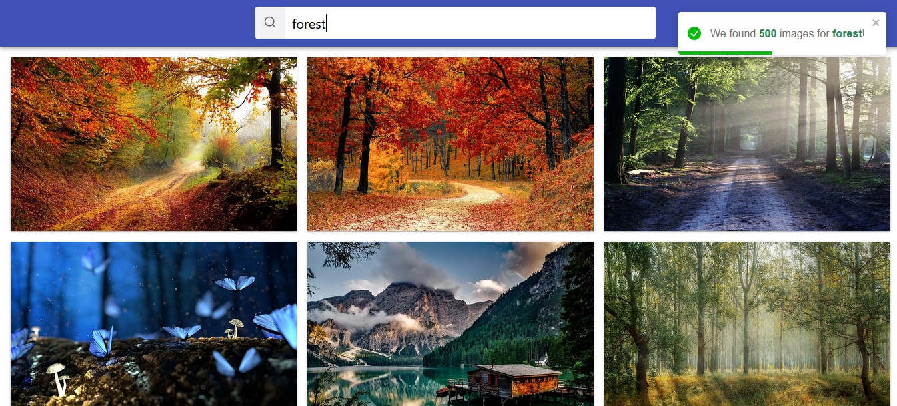
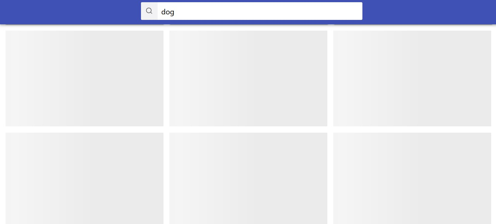

# Image Search App

This is a simple React-based web application for searching and displaying images
using the Pixabay API. Users can enter a search query, and the app fetches
images related to that query. The app also supports pagination, allowing users
to load more images.

## Usage

    1. Enter a search query in the search bar.
    2. Press the "Search" button or hit Enter.
    3. Scroll through the displayed images.
    4. Click on an image to enlarge it.
    5. To load more images, click the "Load more..." button at the bottom.

## Features

- Searchbar: Enter your search query in the search bar and press Enter or click
  the search button. 
- Image Gallery: View the search results in a responsive image gallery.
  
- Image Enlargement: Click on an image to view a larger version in a modal.
  
- Loading Skeleton: Display loading skeletons while images are being fetched.
  
- Error Handling: Display error messages for unsuccessful API requests.
  

## Dependencies

The application uses the following external libraries and tools:

    React: A JavaScript library for building user interfaces.
    Axios: A promise-based HTTP client for making API requests.
    react-icons: Icons for React applications.
    react-loading-skeleton: A lightweight skeleton loader for React.
    react-toastify: A notification library for React.
    styled-components: A CSS-in-JS library for styling React components.

## Contributing

Feel free to contribute to this project by opening issues or pull requests.
